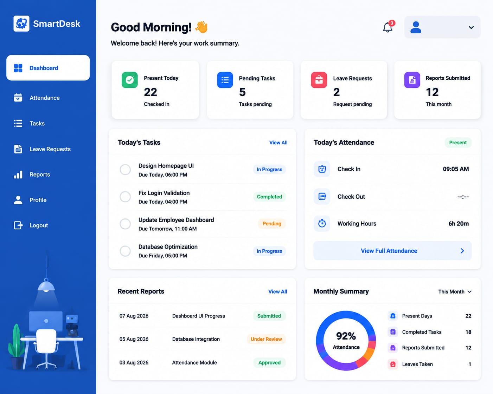

# SmartDesk – Employee Management System

A dynamic web-based Employee Management System developed using Flask, MySQL, HTML, CSS, JavaScript and Bootstrap.

## Features

- Employee & Admin Login
- Attendance Management
- Leave Management
- Task Management
- Reports
- Admin Dashboard
- Employee Dashboard

## Screenshots

.png)
.png)
.png)
.png)

.png)
.png)
.png)
.png)
.png)

.png)

.png)
.png)
.png)
.png)
.png)
.png)

